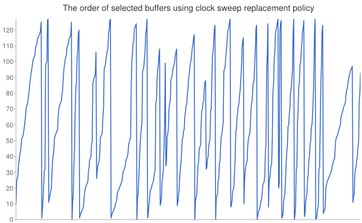
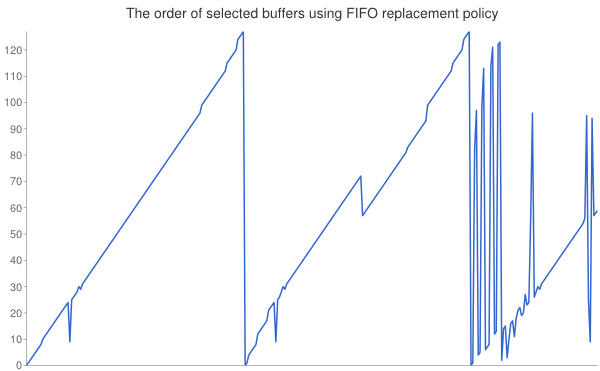

# PostgreSQL Database Management System, FIFO buffer replacement policy

Original clock sweep buffer replacement policy was modified with the FIFO buffer replacement policy.

Buffer ids from ```output/<clock|fifo>.txt``` on trend graphs:



Mechanism
---------
The FIFO buffer replacement policy was achieved by putting a timestamp into every buffer on load, and picking the oldest buffer for replacement when demanded. PostgreSQL includes the timestamping mechanism, (outlined in the header file timestamp.h).

Performance
-----------
The FIFO buffer replacement policy was found to neither outperform nor underperform the clock sweep replacement policy. Two sets of test cases were provided. They were run 30 times each by both the original and the modified programs. The results are in ```output/<clock|fifo><1|2>.txt``` files, respectively. The averages of times reported in these files are within 10 ms:

| file       | average of times reported |
| -----------|-------------------------- |
| clock1.txt | 0.152052.4 s              |
| fifo1.txt  | 0.159859.7 s              |
| clock2.txt | 0.535094.6 s              |
| fifo2.txt  | 0.530696.3 s              |

Testing conditions
------------------
The original command to run psql never had the application to reach the code of buffer replacement policy:
```<install_path>/bin/psql -h localhost <database_name>```
I restricted psql to only 128 buffers using the following modified command to run it:
```<install_path>/bin/psql -B 128 -h localhost <database_name>```

Conclusion
----------
Although I expected the FIFO replacement policy to deteriorate performance of PostgreSQL, I proved that under my testing conditions this was not the case. I have also added a print statement into freelist.c to notify the console of a buffer id whenever it is chosen for replacement. The console output of running the original program and the modified program is captured in ```output/<clock|fifo>.txt files```, respectively.

Text of original README
-----------------------

This directory contains the source code distribution of the PostgreSQL
database management system.

PostgreSQL is an advanced object-relational database management system
that supports an extended subset of the SQL standard, including
transactions, foreign keys, subqueries, triggers, user-defined types
and functions.  This distribution also contains C language bindings.

PostgreSQL has many language interfaces, many of which are listed here:

	http://www.postgresql.org/download

See the file INSTALL for instructions on how to build and install
PostgreSQL.  That file also lists supported operating systems and
hardware platforms and contains information regarding any other
software packages that are required to build or run the PostgreSQL
system.  Changes between all PostgreSQL releases are recorded in the
file HISTORY.  Copyright and license information can be found in the
file COPYRIGHT.  A comprehensive documentation set is included in this
distribution; it can be read as described in the installation
instructions.

The latest version of this software may be obtained at
http://www.postgresql.org/download/.  For more information look at our
web site located at http://www.postgresql.org/.
